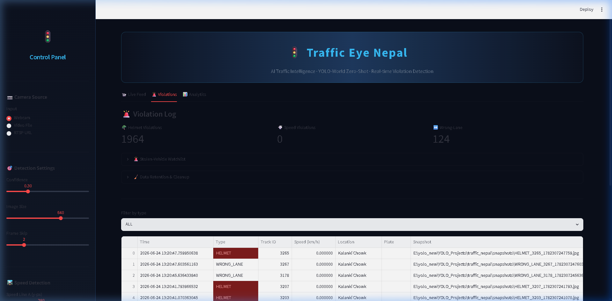
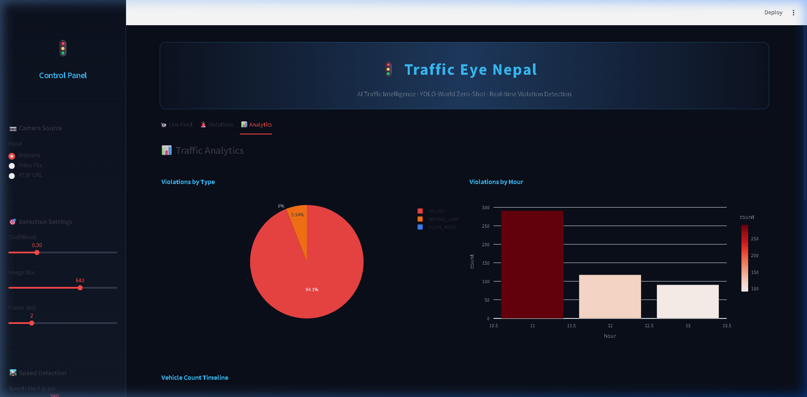
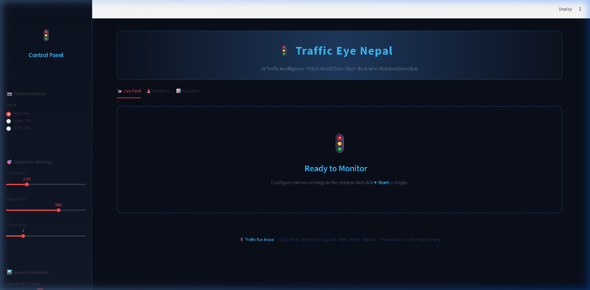

<div align="center">

# 🚦 Traffic Eye Nepal

### AI-Powered Traffic Intelligence System

**Open-vocabulary traffic monitoring built on YOLO-World — helmet violation detection, license plate recognition, speed estimation, congestion analysis, wrong-lane detection, and stolen-vehicle watchlist, all in real time.**

[](https://www.python.org/)
[](https://github.com/AILab-CVC/YOLO-World)
[](https://streamlit.io/)
[](https://fastapi.tiangolo.com/)
[](LICENSE)

</div>

---

## 📖 Overview

Traffic Eye Nepal turns ordinary CCTV/RTSP cameras into an AI traffic-intelligence platform. It uses **YOLO-World** — an open-vocabulary detector — so it recognizes objects from **text prompts** (`motorcycle`, `helmet`, `license plate`, `traffic police`…) without training from scratch. Detections feed a tracking + intelligence pipeline that flags violations, reads plates, estimates speed, and pushes alerts to a live dashboard.

Built specifically with Nepal traffic in mind (motorcycles, microbuses, tempos, Nepali plates), but works anywhere.

---

## ✨ Features

| Feature | Description |
|---|---|
| 🎯 **Open-vocabulary detection** | Detect any object via text prompts using YOLO-World |
| 🪖 **Helmet violation detection** | Flags riders without helmets (multi-frame confirmed to cut false positives) |
| 🔢 **License plate recognition** | Two-stage vehicle-linked OCR (EasyOCR) with Nepal plate normalization |
| 💨 **Speed estimation** | Frame-accurate two-line speed calculation with violation flagging |
| 🚗 **Congestion analysis** | ROI zone vehicle counting → LOW / MEDIUM / HIGH levels |
| ↔️ **Wrong-lane detection** | Detects vehicles moving against allowed traffic direction |
| 🚨 **Stolen-vehicle watchlist** | Instant alert when a flagged plate is detected |
| 🌙 **Night enhancement** | Auto CLAHE enhancement on dark frames for better night detection |
| 📊 **Live dashboard** | Real-time feed, stats, charts, violation log, snapshot gallery |
| ⚡ **Async OCR** | Background OCR thread so the live feed never freezes |
| 🖥️ **GPU auto-detect** | Automatically uses CUDA when available, CPU otherwise |
| 🔌 **REST + WebSocket API** | FastAPI backend with live frame streaming + React frontend |

---

## 📸 Screenshots

> Add your screenshots to the `screenshots/` folder and they will render below.

| Live Detection Feed | Violations Log |
|---|---|
|  |  |

| Analytics Dashboard | Plate Recognition |
|---|---|
|  |  |

---

## 🏗️ System Architecture

```
CCTV / RTSP / Video / Webcam
            │
            ▼
   ┌─────────────────┐
   │  Stream Reader  │  thread-safe, auto-reconnect
   └─────────────────┘
            │
            ▼  (night enhancement on dark frames)
   ┌─────────────────────────────┐
   │  YOLO-World Detection Engine │  open-vocabulary, GPU auto
   └─────────────────────────────┘
            │
            ▼
   ┌─────────────────┐
   │  ByteTracker    │  per-camera IDs, class-consistent
   └─────────────────┘
            │
   ┌────────┴───────────────────────────────────┐
   ▼            ▼            ▼          ▼         ▼
 Helmet      Speed      Congestion  Wrong-Lane  Plate OCR (async)
   │            │            │          │         │
   └────────────┴─────┬──────┴──────────┴─────────┘
                      ▼
              ┌──────────────┐
              │ AlertDispatcher │  SQLite (WAL) + snapshots + watchlist
              └──────────────┘
                      │
          ┌───────────┴────────────┐
          ▼                        ▼
   Streamlit Dashboard       FastAPI + WebSocket → React
```

---

## 🛠️ Technology Stack

### AI / Computer Vision
- **[YOLO-World](https://github.com/AILab-CVC/YOLO-World)** (via Ultralytics) — open-vocabulary object detection
- **OpenCV** — video I/O, image processing, drawing
- **EasyOCR** — license plate text recognition
- **NumPy** — tracking math, IoU, image arrays
- **PyTorch** — model backend (CPU/CUDA)

### Backend
- **FastAPI** — REST API + WebSocket live streaming
- **SQLAlchemy** — ORM
- **SQLite (WAL mode)** — MVP database (PostgreSQL-ready)
- **Celery + Redis** — async task scaffold for scaling

### Frontend
- **Streamlit** — primary live dashboard (Python)
- **Next.js + React + TypeScript** — production web dashboard
- **Tailwind CSS** — styling
- **Recharts** — analytics charts

### Deployment
- **Docker + Docker Compose** — containerized services
- **Nginx** — reverse proxy
- **TensorRT / ONNX** — GPU inference acceleration (export ready)

---

## 📦 Installation

### Prerequisites
- Python 3.10+ (tested on 3.12)
- pip
- **[Git LFS](https://git-lfs.com/)** — required to download the bundled model weights
- (Optional) NVIDIA GPU + CUDA for acceleration

### 1. Clone the repository (with Git LFS)
```bash
# Install Git LFS first (one-time): https://git-lfs.com
git lfs install

git clone https://github.com/thapaprogress/Traffic_nepal.git
cd Traffic_nepal

# If weights didn't download automatically:
git lfs pull
```

> **Note:** Model weights (`weights/*.pt`, `*.pth`, `*.tflite`) and the sample database are bundled via **Git LFS**, so the repo is fully self-contained — no manual model download needed.

### 2. Install dependencies
```bash
pip install -r requirements.txt
```

For license plate OCR:
```bash
pip install easyocr
# EasyOCR pulls a NumPy 2.x; if you hit a NumPy error, pin it:
pip install "numpy<2"
```

### 3. Download the YOLO-World model
The model weights are **already bundled** via Git LFS in `weights/`:
- `yolov8s-worldv2.pt` — default zero-shot model (used by the dashboard)
- `yolo_world_v2_s_obj365v1_goldg_pretrain-55b943ea.pth` — pretrained for fine-tuning
- `yolo_world_x_coco_zeroshot_rep_integer_quant.tflite` — INT8 TFLite sample
- `clip_vit_b32_coco_80_embeddings.npy` — COCO CLIP embeddings

If `weights/` is empty after cloning, run `git lfs pull`.

### 4. Run the dashboard
```bash
streamlit run app.py
```
Open **http://localhost:8501** (or 8502).

### 5. (Optional) Run the FastAPI backend
```bash
python -m uvicorn api.main:app --reload --port 8000
# Swagger docs: http://localhost:8000/docs
```

### 6. (Optional) Run the React frontend
```bash
cd frontend
npm install
npm run dev
# http://localhost:3000
```

---

## 🚀 Usage

1. Open the Streamlit dashboard.
2. In the sidebar pick a **source** — Webcam, Video File (up to 2 GB), or RTSP URL.
3. Configure **detection settings**, **speed lines**, and **intelligence modules** (wrong-lane direction, night enhancement, watchlist).
4. Click **▶ Start**.
5. Watch the live feed with bounding boxes, plate labels, and violation overlays.
6. Switch to **🚨 Violations** to see the log, add stolen plates to the watchlist, and view snapshots.
7. Switch to **📊 Analytics** for charts and the congestion timeline.

---

## 📁 Project Structure

```
traffic_nepal/
├── app.py                      # Streamlit live dashboard
├── config/settings.py          # Central configuration
├── detection/
│   └── yoloworld_engine.py     # YOLO-World wrapper (GPU auto-detect)
├── ingest/
│   ├── stream_reader.py        # RTSP/webcam/file reader + auto-reconnect
│   └── camera_manager.py       # Multi-camera manager
├── tracking/
│   └── bytetrack_wrapper.py    # IoU tracker, per-camera IDs, class-consistent
├── intelligence/
│   ├── helmet_rule.py          # Helmet violation + multi-frame confirmation
│   ├── speed_estimator.py      # Frame-based speed estimation
│   ├── congestion_monitor.py   # ROI zone congestion
│   ├── plate_ocr.py            # Two-stage vehicle-linked OCR
│   ├── async_ocr.py            # Background OCR worker
│   ├── wrong_lane.py           # Wrong-direction detection
│   ├── watchlist.py            # Stolen-vehicle watchlist
│   └── night_enhance.py        # Low-light enhancement
├── alerts/
│   ├── alert_dispatcher.py     # SQLite (WAL) + snapshots + dedup
│   └── sms_alert.py            # Twilio SMS (+ mock mode)
├── workers/
│   ├── pipeline.py             # Main per-camera inference pipeline
│   └── celery_app.py           # Async task scaffold
├── api/                        # FastAPI backend (cameras, violations, stats, stream, auth, reports)
├── frontend/                   # Next.js + React + Tailwind dashboard
├── deploy/export_engine.py     # ONNX / TensorRT export
├── docker-compose.yml          # Containerized stack
└── requirements.txt
```

---

## 🧠 How It Works

- **Detection:** YOLO-World is given text prompts (vehicle classes, helmet, plate, etc.) and returns boxes.
- **Tracking:** A class-consistent IoU tracker assigns persistent per-camera IDs.
- **Plate OCR:** For each tracked vehicle, a plate crop is taken from the full-res frame and queued to a background OCR thread; the result is cached per track ID and linked to violations.
- **Speed:** Two virtual lines; speed = real-world distance ÷ (frames between crossings ÷ source FPS) — accurate regardless of inference latency.
- **Violations:** Helmet (multi-frame confirmed), speed, wrong-lane, and watchlist hits are written to the DB with the plate number attached and a snapshot saved.

---

## ✅ Completed Work

- [x] Real-time open-vocabulary detection (YOLO-World)
- [x] Multi-object tracking with persistent IDs
- [x] Helmet violation detection (multi-frame confirmed)
- [x] License plate recognition (async, vehicle-linked)
- [x] Frame-accurate speed estimation
- [x] Congestion (ROI) analysis
- [x] Wrong-lane / wrong-direction detection
- [x] Stolen-vehicle watchlist + management UI
- [x] Night-time frame enhancement
- [x] SQLite storage (WAL, indexed, deduped) + snapshots
- [x] Streamlit live dashboard (3 tabs)
- [x] FastAPI backend (REST + WebSocket)
- [x] React/Next.js frontend scaffold
- [x] Docker Compose + Dockerfiles
- [x] GPU auto-detection
- [x] 2 GB upload support

---

## 🔭 Remaining Work & GPU Roadmap

These require a CUDA GPU (e.g. RTX 4080) — see [`TODO_GPU_TASKS.md`](TODO_GPU_TASKS.md) for step-by-step instructions.

| Task | Description | Benefit |
|---|---|---|
| **TensorRT FP16 export** | `python deploy/export_engine.py --format engine --half` | 3–6 → 35–50 FPS |
| **Nepal dataset fine-tuning** | Train on Kathmandu CCTV (helmet, microbus, tempo, plates) | Much higher accuracy |
| **Real ByteTrack / BoT-SORT** | Kalman-filter tracker | Fewer ID switches under occlusion |
| **PaddleOCR backend** | Swap/compare OCR engine | Better Nepali plate reads |
| **MinIO / S3 snapshots** | Object storage for snapshots | Scales beyond local disk |
| **Leaflet map view** | Camera pins colored by congestion | City-wide visualization |
| **Redis pub/sub scaling** | Multi-intersection event bus | 20–50 cameras |
| **Alembic migrations** | PostgreSQL schema versioning | Production DB upgrades |

### GPU Quick Start (when available)
```bash
# Verify CUDA
python -c "import torch; print(torch.cuda.is_available())"

# Export TensorRT engine (auto-used on next run)
python deploy/export_engine.py --format engine --half

# The detection engine auto-detects CUDA — no code change needed
```

---

## 🤝 Contributing

Pull requests welcome. For major changes, open an issue first to discuss what you'd like to change.

---

## 📜 License

MIT License — see [LICENSE](LICENSE).

---

## 🙏 Acknowledgements

- [YOLO-World](https://github.com/AILab-CVC/YOLO-World) by Tencent AI Lab
- [Ultralytics](https://github.com/ultralytics/ultralytics)
- [EasyOCR](https://github.com/JaidedAI/EasyOCR)

<div align="center">

**Built with ❤️ for safer roads in Nepal**

</div>
